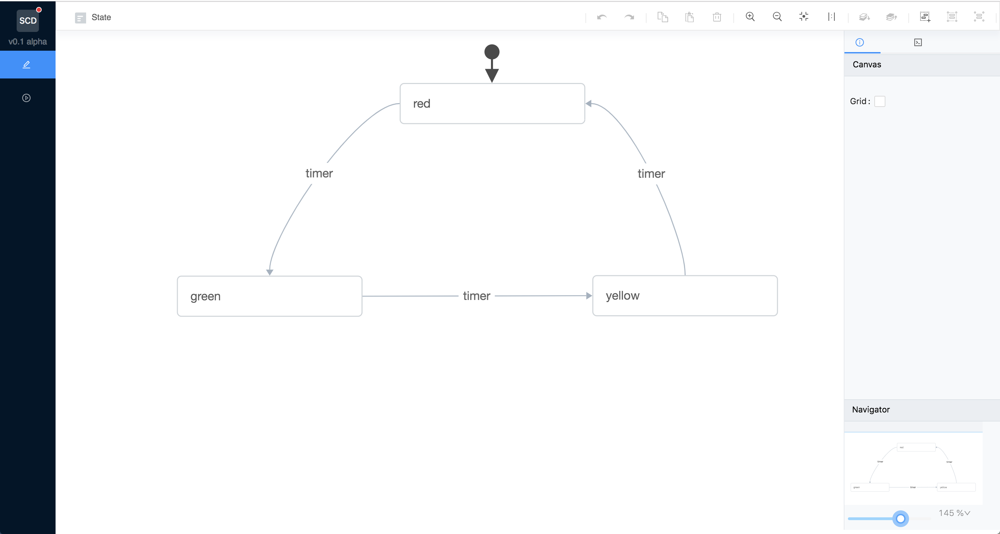

# Statechart Designer

Statechart Designer aims to push [statechart](https://statecharts.github.io) development in JS ahead.

Short term goals include:

- [x] build statecharts and export to xState
- [x] test and play around with a statechart
- [ ] generate statechart visualizations from xState configurations
- [ ] connect a live statechart to an application as devtools

### Collaboration

See the [Project board](https://github.com/ShMcK/statechart-designer/projects/1).

If you're a designer or developer interested in contributing/collaborating, shoot me an email or Twitter DM. Contact info is available on my Github profile.

### Resources

The editor hacks upon the G6 Editor from Ant Design.

- [G6](https://antv.alipay.com/zh-cn/g6/1.x/api/index.html)
  - great documentation and source code
- [G6 Editor](https://www.yuque.com/antv/g6-editor/editor-api)
  - provides only limited documentation and no source code.
